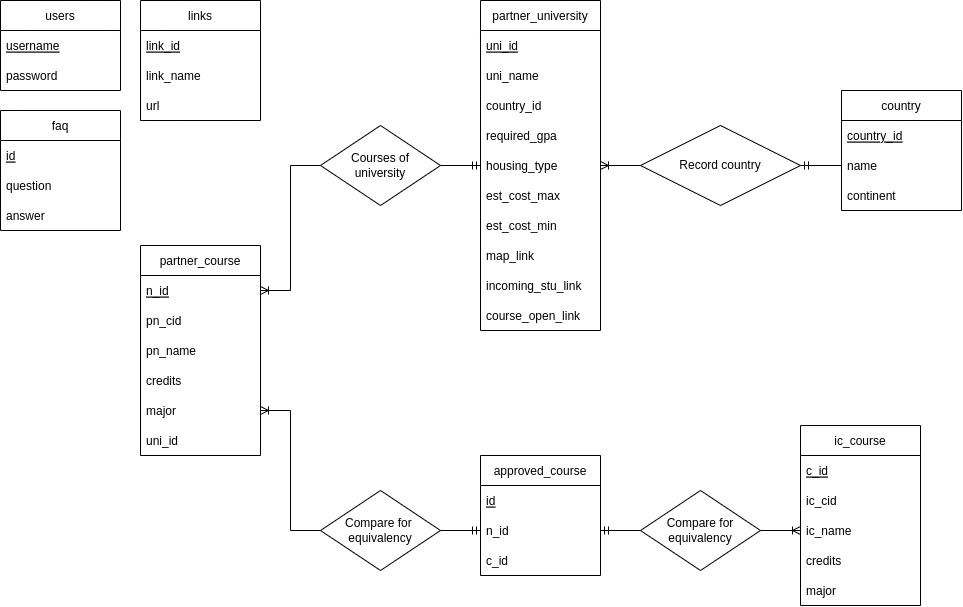

# IC Abroad Rework/Clone

This project is part of the course ICCS225: Database Foundations. The proposal for this project can
be found in `proposal/` directory of this repo. Essentially, it is a redo of the website IC Abroad
(found [here](https://sites.google.com/mahidol.edu/icabroad/home)). The goal is to replicate a some
of the non-hard-coded pages from the original website. This means that pages where there could relate
to database operations will be kept, while the rest are discarded in the interest of time and effort.

# Database Model

## ER Diagram



## Relation Model

To simplify things, the following relations are written in the form of data definition in SQL. The constraints and keys can be found here as well.

```sql
create table approved_course
(
    id   int auto_increment
        primary key,
    n_id int not null,
    c_id int not null,
    constraint unique_approval
        unique (n_id, c_id),
    constraint approved_course_ic_course_null_fk
        foreign key (c_id) references ic_course (c_id),
    constraint approved_course_partner_course_null_fk
        foreign key (n_id) references partner_course (n_id)
);

create table country
(
    country_id int auto_increment
        primary key,
    name       varchar(255) not null,
    continent  varchar(255) not null
);

create table faq
(
    id       int auto_increment
        primary key,
    question varchar(255) null,
    answer   text         not null
);

create table ic_course
(
    c_id    int auto_increment
        primary key,
    ic_cid  varchar(255)    not null,
    ic_name varchar(255)    not null,
    credits int             not null,
    major   enum (
        'Marketing',
        'International Business',
        'Finance',
        'Business Economics',
        'Computer Engineering',
        'Creative Technology',
        'Physics',
        'Food Science and Technology',
        'Computer Science',
        'Chemistry',
        'Biological Science',
        'Applied Mathematics',
        'Communication Design',
        'Media and Communication',
        'Intercultural Studies and Languages',
        'International Relations and Global Affairs',
        'Travel and Service Business Entrepreneurship'
    )                       null
);

create table links
(
    link_id   int auto_increment
        primary key,
    link_name varchar(255) not null,
    url       tinytext     not null
);

create table partner_course
(
    n_id    int auto_increment
        primary key,
    pn_cid  varchar(255) not null,
    pn_name varchar(255) null,
    credits int          null,
    major   varchar(255) null,
    uni_id  int          not null,
    constraint n_id
        unique (n_id),
    constraint partner_course_partner_university_null_fk
        foreign key (uni_id) references partner_university (uni_id)
);

create table partner_university
(
    uni_id            int auto_increment
        primary key,
    uni_name          varchar(255) not null,
    country_id        int          not null,
    required_gpa      float        null,
    housing_type      int          null,
    est_cost_max      int          null,
    est_cost_min      int          null,
    map_link          varchar(255) null,
    incoming_stu_link varchar(255) null,
    course_open_link  varchar(255) null,
    constraint uni_name
        unique (uni_name),
    constraint partner_university_country_null_fk
        foreign key (country_id) references country (country_id)
);

create table users
(
    username varchar(255) not null
        primary key,
    password varchar(255) not null
);
```

# Demo

The web app is deployed at [www.araaraphilosopher.com](https://www.araaraphilosopher.com/).
You can check out the functional website there. However, the web app may be down if checked
after 2022 as the server this is running on is a personal server so it may be serving
something else.

The presentation on this web app can be found [here](https://www.youtube.com/watch?v=dQw4w9WgXcQ&ab_channel=RickAstley).
